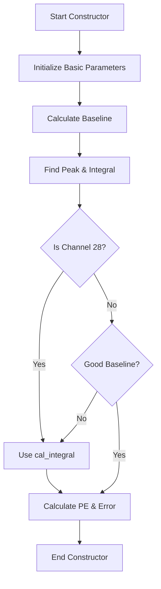
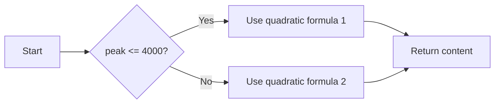
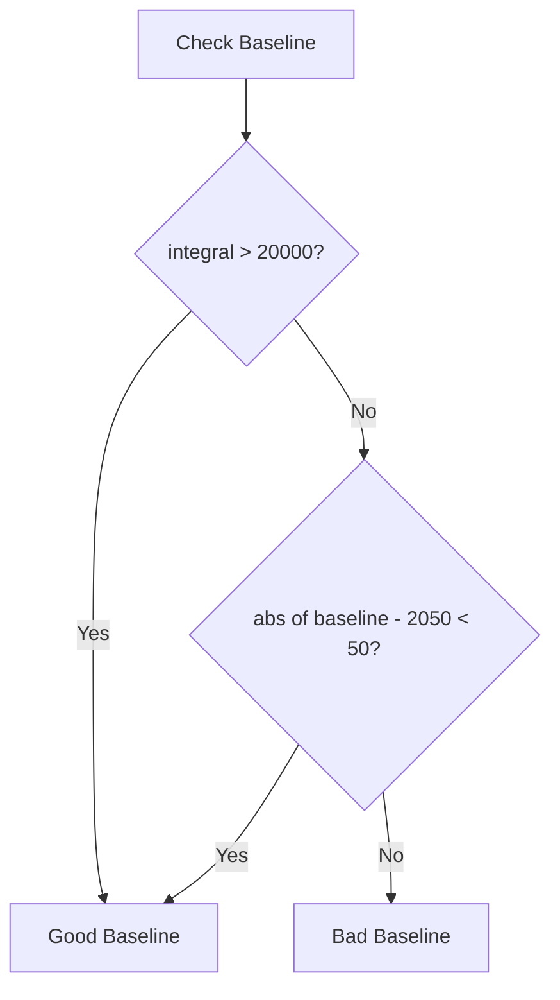

# COphit Class Documentation

## Overview
The `COphit` class is designed to handle optical hits in a detector system, focusing on photoelectron measurements and processing. It's part of the WCP (Wire-Cell Proto) namespace and provides functionality for analyzing histogram data to determine various optical properties.

## Class Members

### Protected Variables
```cpp
bool good_baseline      // Flag indicating if the baseline is valid
int channel_no         // FEM channel number
double gain           // Gain value for the channel
double gain_err       // Error in the gain measurement
double time           // Start time in microseconds
double baseline       // Baseline value
double peak           // Maximum PE (PhotoElectron) value
double integral       // Integral value
double PE             // Calculated PhotoElectrons
double PE_err         // Error in PE calculation
```

### Public Methods

#### Constructors & Destructor
```cpp
// Main constructor
COphit(int ch_no, TH1S *hist, double time, double gain, double gain_err)

// Destructor
~COphit()
```

#### Getter Methods
```cpp
double get_time()      // Returns the start time in microseconds
double get_baseline()  // Returns the baseline value
double get_peak()      // Returns the maximum PE value
double get_integral()  // Returns the integral value
double get_gain()      // Returns the gain value
int get_ch_no()       // Returns the FEM channel number
double get_PE()       // Returns the calculated PhotoElectrons
double get_PE_err()   // Returns the error in PE calculation
bool get_type()       // Returns the baseline validity flag
```

### Protected Methods
```cpp
double cal_integral(double peak)  // Calculates integral based on peak value
```

## Implementation Details

### Constructor Processing
The constructor performs several key operations:
1. Initializes basic parameters (channel number, time, gain, gain error)
2. Calculates baseline from the first bin of the input histogram
3. Processes histogram to find peak value and calculate integral
4. Implements special handling for channel 28
5. Calculates PE and PE error with uncertainty propagation

### Integral Calculation
The `cal_integral` method uses a piecewise function for calculation:
- For peak ≤ 4000:
  ```
  content = 1.06241e+01 * peak + 2.01214e-04 * peak²
  ```
- For peak > 4000:
  ```
  content = 4.5715824e4 + 8.62296e+00 * (peak - 4000) + 6.76898e-04 * (peak-4000)²
  ```

### PE Calculation
The class implements sophisticated PE calculation with error propagation:
1. For good baseline conditions:
   - PE = integral / gain * 2
   - Includes multiple error sources:
     - Gain uncertainties
     - Statistical term
     - Baseline uncertainties
     - 3% relative uncertainties
2. For poor baseline conditions:
   - PE = integral / gain * 2
   - Assigns 200% uncertainties

### Special Cases
1. Special processing for channel 28
2. Alternative integral calculation for poor baseline conditions
3. Zero PE handling (sets to 0 if calculated PE is negative)

## Associated Types
```cpp
typedef std::vector<COphit*> COphitSelection;  // Vector of COphit pointers
```

## Usage Notes
- The class expects TH1S histogram input with proper binning
- Baseline quality affects uncertainty calculations
- Special handling exists for certain channels (e.g., channel 28)
- All time values are in microseconds
- PE calculations include a factor of 2 for 0.6 μs window

# COphit Class Logic Analysis

## Constructor Logic Flow
The constructor is the most complex part of the class, handling the initialization and processing of optical hit data.



### Constructor Code Analysis
```cpp
WCP::COphit::COphit(int ch_no, TH1S *hist, double time, double gain, double gain_err)
  : channel_no(ch_no)
  , time(time)
  , gain(gain)
  , gain_err(gain_err)
{
  // 1. Calculate baseline from first bin
  baseline = hist->GetBinContent(1);
  
  // 2. Find peak and calculate integral
  peak = 0;
  integral = 0;
  for (int i=0; i!=40; i++){
    double content = hist->GetBinContent(i+1) - baseline;
    if (content > peak){
      peak = content;
    }
    integral += content;
  }

  // 3. Check baseline quality
  good_baseline = false;
  if (integral > 20e3 || fabs(baseline-2050)<50) 
    good_baseline = true;

  // 4. Special handling for channel 28 or bad baseline
  if (channel_no == 28 || !good_baseline) 
    integral = cal_integral(peak);
  
  // 5. Calculate PE and error
  if (good_baseline) {
    PE = integral / gain * 2;  // Factor of 2 for 0.6 μs window
    if (PE < 0) PE = 0;

    // Error calculation with multiple components
    PE_err = sqrt(
      pow(PE * gain_err/gain, 2) +      // Gain uncertainty
      2 * PE +                          // Statistical term
      pow(40/sqrt(3.)/gain * 2, 2) +    // Baseline uncertainty
      pow(PE*0.03, 2)                   // 3% relative uncertainty
    );
  } else {
    PE = integral/gain * 2;
    if (PE < 0) PE = 0;
    PE_err = 2 * PE;  // 200% uncertainty for bad baseline
  }
}
```

## Integral Calculation Logic
The `cal_integral` method uses a piecewise function based on peak value:



### Integral Calculation Formulas:
For peak ≤ 4000:
```
content = (10.6241 × peak) + (0.0002012 × peak²)
```

For peak > 4000:
```
content = 45715.824 + 8.62296(peak - 4000) + 0.000676898(peak - 4000)²
```

## PE Error Calculation Logic
The PE error calculation depends on baseline quality:

### Good Baseline Case
Error components:
1. Gain uncertainty: `PE × (gain_err/gain)`
2. Statistical fluctuation: `√(2 × PE)`
3. Baseline uncertainty: `40/√3/gain × 2`
4. Relative uncertainty: `PE × 0.03`

Total error is the quadratic sum of these components:
```cpp
PE_err = sqrt(
    pow(PE * gain_err/gain, 2) +    // Gain uncertainty
    2 * PE +                        // Statistical term
    pow(40/sqrt(3.)/gain * 2, 2) +  // Baseline uncertainty
    pow(PE*0.03, 2)                 // 3% relative uncertainty
);
```

### Bad Baseline Case
For poor baseline quality, a simplified error estimate is used:
```cpp
PE_err = 2 * PE;  // 200% uncertainty
```

## Baseline Quality Assessment
Baseline quality is determined by two criteria:
1. Large integral: `integral > 20000`
2. Baseline near nominal: `|baseline - 2050| < 50`



This baseline quality assessment affects both the integral calculation method and the error estimation approach.

## Special Cases

### Channel 28 Handling
Channel 28 always uses the `cal_integral` method regardless of baseline quality:
```cpp
if (channel_no == 28) integral = cal_integral(peak);
```

### Zero PE Protection
Negative PE values are set to zero:
```cpp
if (PE < 0) PE = 0;
```