# FlashTPCBundle Class Documentation

## Class Overview
The FlashTPCBundle class is a data structure that associates optical flashes with TPC (Time Projection Chamber) clusters in particle physics detection. It manages relationships between optical flash data and cluster data while providing various analysis capabilities.

## Internal Variables

### Primary Data Members
- `Opflash* flash`: Pointer to the associated optical flash
- `PR3DCluster* main_cluster`: Pointer to the main 3D cluster
- `PR3DCluster* orig_main_cluster`: Pointer to the original main cluster
- `std::vector<double> pred_pmt_light`: Vector of predicted PMT light values (size 32)

### Identification Members
- `int flash_index_id`: Flash index identifier
- `int cluster_index_id`: Cluster index identifier
- `double strength`: Strength value of the association

### State Flags
- `bool flag_close_to_PMT`: Indicates if cluster is close to PMT
- `bool flag_at_x_boundary`: Indicates if cluster is at x boundary
- `bool flag_spec_end`: Special end flag
- `bool flag_potential_bad_match`: Indicates potential bad match
- `bool flag_high_consistent`: Indicates high consistency

### Analysis Results
- `double ks_dis`: Kolmogorov-Smirnov test distance
- `double chi2`: Chi-square value
- `int ndf`: Number of degrees of freedom

### Cluster Collections
- `PR3DClusterSelection other_clusters`: Collection of other associated clusters
- `PR3DClusterSelection more_clusters`: Collection of additional clusters meeting criteria

## Implementation Details

### Constructor
```cpp
FlashTPCBundle(Opflash* flash, PR3DCluster* main_cluster, 
               int flash_index_id, int cluster_index_id)
```
- Initializes a new bundle with flash and cluster associations
- Sets initial state flags to false
- Initializes prediction vector with 32 zeros
- Initial values: ks_dis=1, chi2=0, ndf=0, strength=0

### Core Analysis Functions

### Complex Function Analysis

#### examine_bundle
```cpp
bool examine_bundle(Double_t* cos_pe_low, Double_t* cos_pe_mid)
```
This function evaluates the compatibility between predicted and measured light patterns.

**Logic Flow:**
1. Creates histograms for measured and predicted light patterns
2. For each PMT channel (0-31):
   - Compares predicted vs measured PE (PhotoElectrons)
   - Applies threshold cuts based on cos_pe_low and cos_pe_mid
3. Performs Kolmogorov-Smirnov test
4. Calculates χ² and degrees of freedom
5. Determines consistency based on multiple criteria:
   ```cpp
   if (ks_dis < 0.06 && ndf >= 3 && chi2 < ndf * 36) {
       flag_high_consistent = true;
   } else if (ks_dis < 0.05 && ndf >= 6 && chi2 < ndf * 45) {
       flag_high_consistent = true;
   }
   // ... additional criteria
   ```

#### examine_beam_bundle
```cpp
bool examine_beam_bundle()
```
Specialized analysis for beam-related bundles:
1. Creates histograms similar to examine_bundle
2. Calculates initial KS test
3. Computes χ² contribution from each PMT
4. Removes worst-contributing PMT and recalculates KS test
5. Returns true if either:
   - Initial KS test < 0.1 OR modified KS test < 0.05
   - AND χ² conditions are met

#### examine_merge_clusters
```cpp
void examine_merge_clusters(double dis_cut = 3.6*units::cm)
```
Analyzes whether clusters should be merged based on spatial proximity.

**Algorithm Steps:**
1. For each cluster in other_clusters:
   - Finds closest points between current cluster and main cluster
   - Uses iterative approach to refine closest points
   - If distance < dis_cut, adds to merge_clusters
2. If merge_clusters not empty:
   - Creates new cluster with main_cluster ID
   - Transfers all cells from merged clusters
   - Deletes old clusters
   - Updates main_cluster pointer

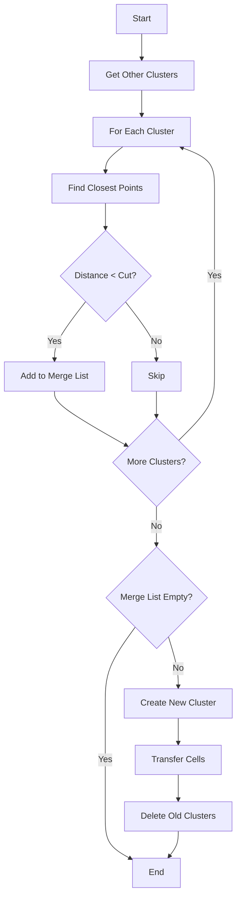

#### add_bundle
```cpp
void add_bundle(FlashTPCBundle* bundle, Double_t* cos_pe_low, Double_t* cos_pe_mid)
```
Combines two bundles based on their quality metrics:
1. Compares quality metrics:
   ```cpp
   if (ks_dis * pow(chi2/ndf,0.8)/get_total_pred_light() < 
       bundle->get_ks_dis() * pow(bundle->get_chi2()/bundle->get_ndf(),0.8)/
       bundle->get_total_pred_light())
   ```
2. Transfers clusters based on comparison
3. Updates predicted light values
4. Re-examines combined bundle

### Comparison Functions

#### examine_bundle_rank
Similar to examine_bundle but with modified acceptance criteria for ranking purposes:
- More lenient KS test thresholds
- Additional criteria for high PMT readings
- Special handling for clusters near PMTs

## Configuration Management
The class includes several setter/getter methods for managing state and configuration:
- Flash and cluster associations
- Analysis flags and results
- Cluster collections

## Usage Example
```cpp
// Create bundle
FlashTPCBundle bundle(flash_ptr, cluster_ptr, flash_id, cluster_id);

// Set configuration
bundle.set_flag_close_to_PMT(true);
bundle.set_flag_at_x_boundary(false);

// Perform analysis
Double_t cos_pe_low[32] = {...};  // Lower thresholds
Double_t cos_pe_mid[32] = {...};  // Middle thresholds
bool is_consistent = bundle.examine_bundle(cos_pe_low, cos_pe_mid);

// Check results
if (is_consistent && bundle.get_consistent_flag()) {
    // Process consistent bundle
}
```

### Advanced Analysis Functions in Detail

#### Consistency and Quality Checks
The class implements several layers of quality checks and consistency validations:

##### 1. examine_bundle's Advanced Analysis
```cpp
bool examine_bundle(Double_t* cos_pe_low, Double_t* cos_pe_mid)
```

**Detailed Algorithm Steps and Flow:**

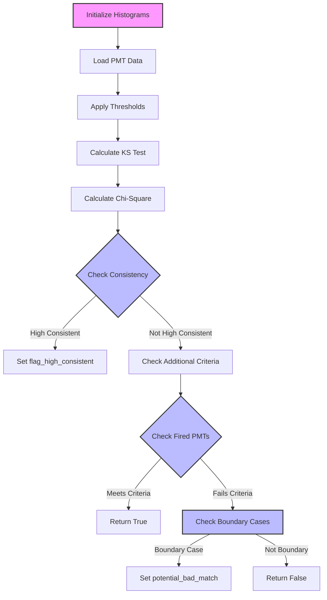

**Detailed Algorithm Steps:**
1. **Histogram Creation and Initial Setup**
   ```cpp
   TH1F *h1 = new TH1F("h1","h1",32,0,32);  // Measured light
   TH1F *h2 = new TH1F("h2","h2",32,0,32);  // Predicted light
   ```

2. **PMT Response Analysis**
   ```cpp
   for (int i=0; i!=32; i++) {
       pe[i] = flash->get_PE(i);
       pe_err[i] = flash->get_PE_err(i);
       pred_pe[i] = pred_pmt_light.at(i);
   }
   ```

3. **Threshold Application**
   ```cpp
   if ((pred_pe[j] < cos_pe_low[j] ||
       (pred_pe[j] < cos_pe_mid[j]*1.1 && pe[j] ==0 )) 
       && flash->get_type()==1) {
       pred_pe[j] = 0;
   }
   ```

4. **Statistical Analysis**
   - Kolmogorov-Smirnov test for distribution comparison
   - Chi-square calculation with PMT-specific error handling
   - Degrees of freedom tracking

5. **Multi-Criteria Consistency Check**
   ```mermaid
   graph TD
       A[Start Analysis] --> B{KS Test < 0.06?}
       B -- Yes --> C{ndf >= 3?}
       B -- No --> D{KS Test < 0.05?}
       C -- Yes --> E{chi2 < ndf * 36?}
       D -- Yes --> F{ndf >= 6?}
       E -- Yes --> G[Set High Consistent]
       F -- Yes --> H{chi2 < ndf * 45?}
       H -- Yes --> G
   ```

##### 2. examine_bundle_rank's Detailed Operation
```cpp
bool examine_bundle_rank(FlashTPCBundle *bundle, Double_t *cos_pe_low, Double_t *cos_pe_mid)
```

**Key Components:**
**Algorithm Visualization:**

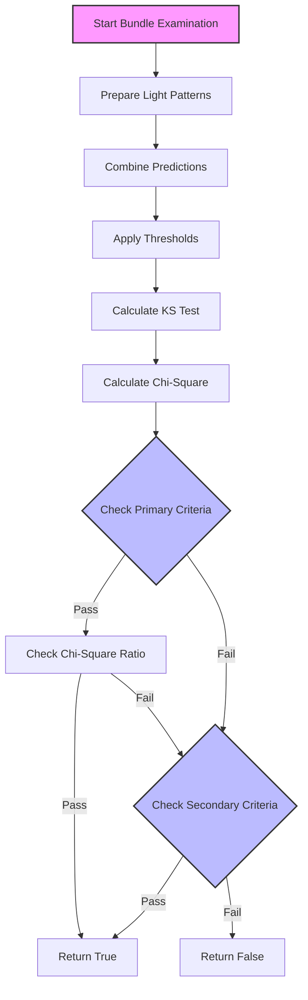

1. **Combined Light Pattern Analysis**
   ```cpp
   double pred_pe[32];
   for (int i=0; i!=32; i++) {
       pred_pe[i] = pred_pmt_light.at(i) + 
                    bundle->get_pred_pmt_light().at(i);
   }
   ```

2. **Enhanced Chi-Square Calculation**
   - Special handling for PMT proximity
   - Adjustments for high-intensity readings
   ```cpp
   if (flag_close_to_PMT) {
       if (pe[j]-pred_pe[j]>350 && pe[j]>pred_pe[j]*1.3) {
           cur_chi2 = pow(pred_pe[j]-pe[j],2)/
                      (pow(pe_err[j],2)+pow(pe[j]*0.5,2));
       }
   }
   ```

3. **Ranking Criteria:**
   ```cpp
   if ((temp_ks_dis < ks_dis + 0.06 &&
        (temp_ks_dis < ks_dis * 1.2 || 
         temp_ks_dis < 0.05 || 
         temp_ks_dis < ks_dis + 0.03) && 
        temp_chi2 < chi2 + ndf * 5 &&
        temp_chi2 < chi2 * 1.21) ||
       (temp_ks_dis < ks_dis &&
        temp_chi2 < chi2 + ndf * 10 &&
        temp_chi2 < chi2 * 1.45) ||
       (temp_ks_dis * temp_chi2 < ks_dis * chi2))
   ```

##### 3. examine_merge_clusters Extended Analysis
The merging algorithm employs sophisticated spatial analysis:

1. **Initial Distance Calculation**
   ```cpp
   double dis = sqrt(pow(p1.x-p2.x,2) + 
                    pow(p1.y-p2.y,2) + 
                    pow(p1.z-p2.z,2));
   ```

2. **Iterative Point Refinement**
   ```mermaid
   graph TD
       A[Start] --> B[Get Initial Points]
       B --> C[Calculate Distance]
       C --> D[Find Closest Point in Cluster 2]
       D --> E[Find Closest Point in Cluster 1]
       E --> F{Points Changed?}
       F -- Yes --> C
       F -- No --> G[Final Distance]
   ```

3. **Cluster Merging Process**
   - Creates new cluster preserving ID
   - Transfers cells maintaining time slice information
   - Updates associations and deletes old clusters

##### 4. add_bundle Complexity and Flow

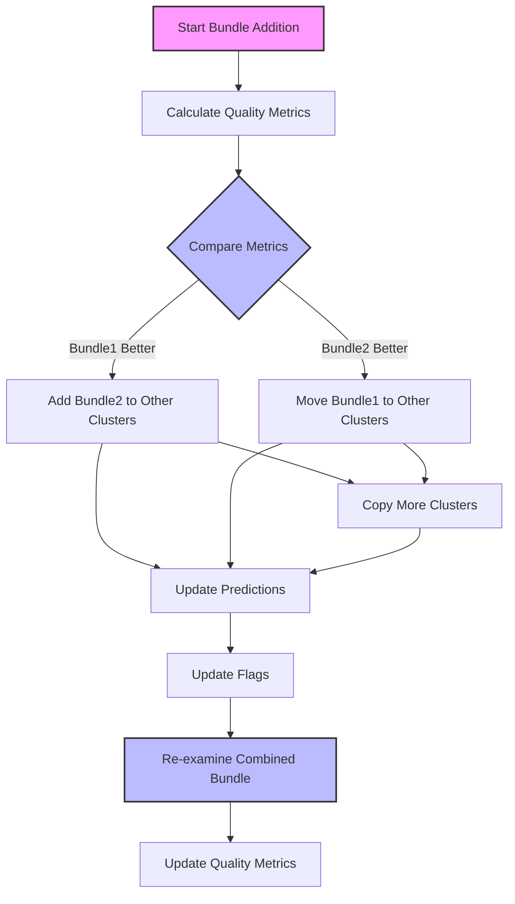

##### 4. add_bundle Complexity
The bundle addition process involves:

1. **Quality Metric Comparison**
   ```cpp
   double quality1 = ks_dis * pow(chi2/ndf,0.8) / 
                    get_total_pred_light();
   double quality2 = bundle->get_ks_dis() * 
                    pow(bundle->get_chi2()/bundle->get_ndf(),0.8) / 
                    bundle->get_total_pred_light();
   ```

2. **Cluster Management:**
   - Conditional transfer of clusters
   - Update of cluster hierarchies
   - Light prediction combination

3. **Post-Addition Analysis**
   - Re-examination of combined bundle
   - Update of quality metrics
   - Flag updates

##### 5. examine_beam_bundle Algorithm

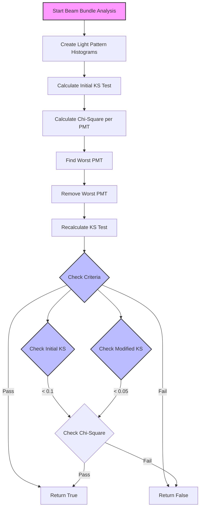

### Error Handling and Edge Cases

1. **PMT Response Variations**
   ```cpp
   if (pe[j]-pred_pe[j]>350 && pe[j]>pred_pe[j]*1.3) {
       // Handle extreme PMT responses
       cur_chi2 = pow(pred_pe[j]-pe[j],2)/
                  (pow(pe_err[j],2)+pow(pe[j]*0.5,2));
   }
   ```

2. **Boundary Conditions**
   ```cpp
   if (flag_at_x_boundary && (!flag_close_to_PMT)) {
       // Special handling for boundary cases
       if (nfired == 0) {
           flag_potential_bad_match = true;
       }
   }
   ```

3. **Low Statistics Handling**

## Function Interactions and Dependencies

### 1. Bundle Analysis Sequence

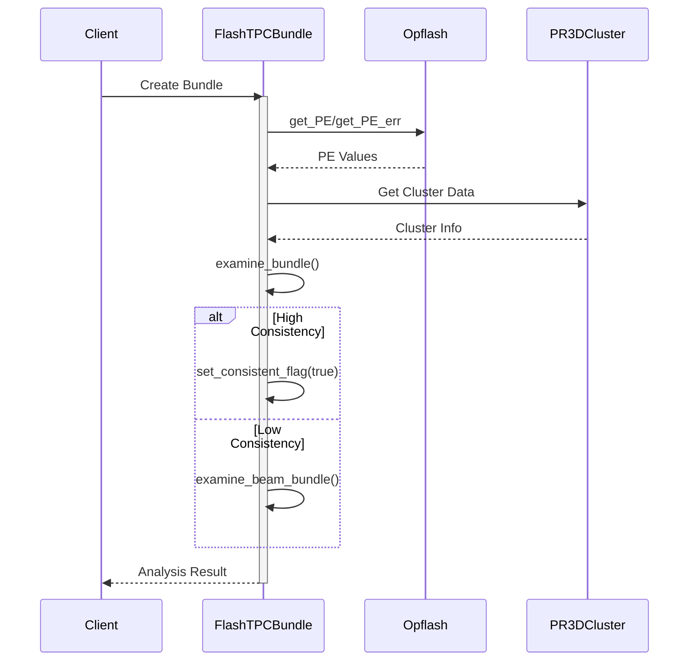

### 2. Bundle Merging Process

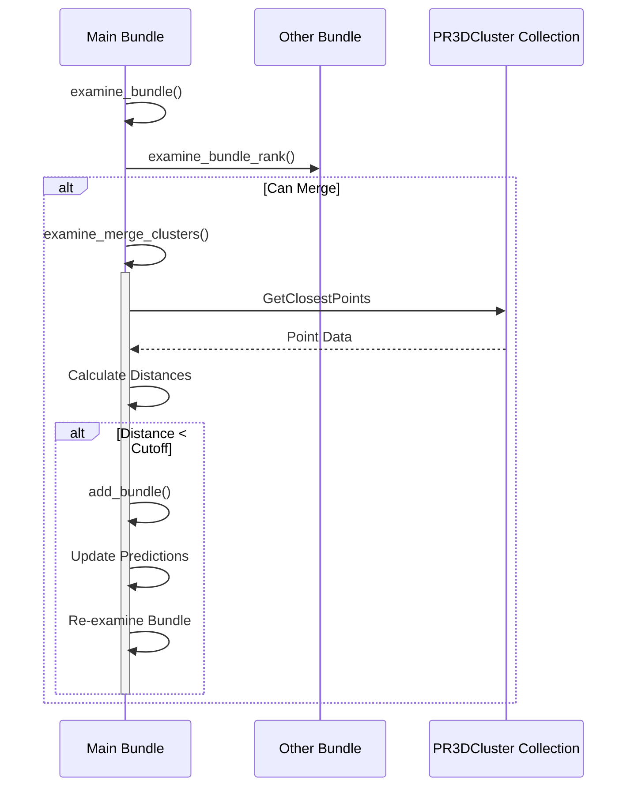

### 3. Component Interaction Map

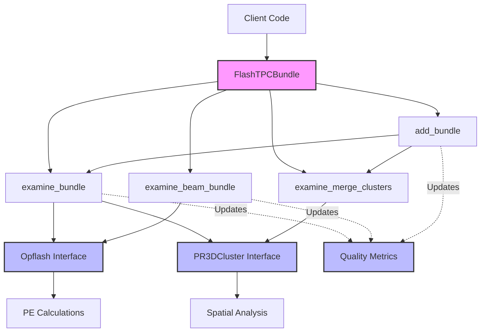

### 4. Data Flow Between Analysis Functions

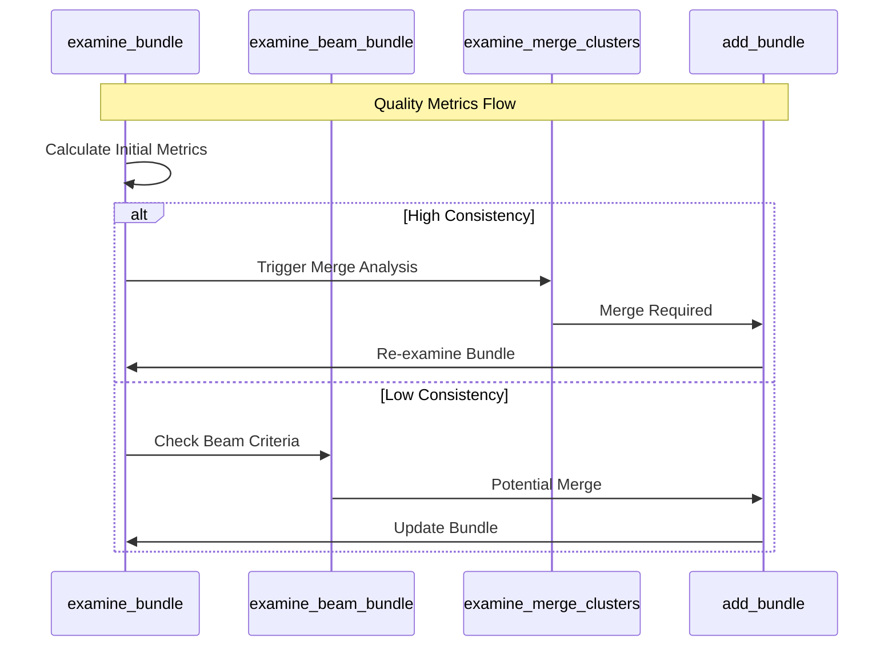

### 5. State Transitions During Analysis

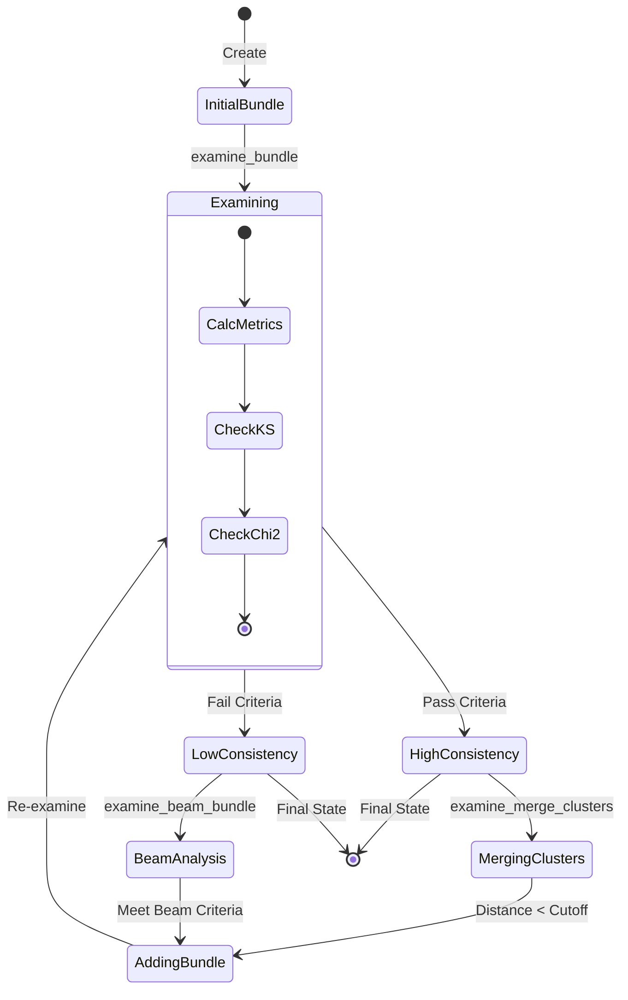

These diagrams illustrate:

##### 6. Bundle Analysis Decision Tree

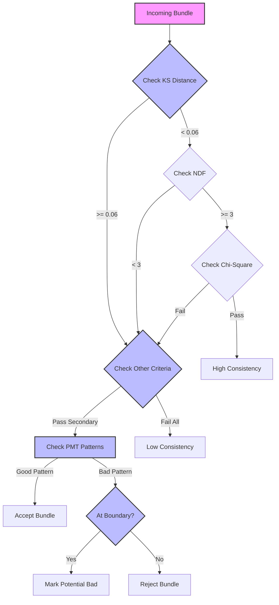

These diagrams illustrate the complex decision trees and flows in the bundle analysis process. Each node represents a critical decision point or operation in the analysis pipeline.
   ```cpp
   if (nfired <= 1 && (nfired1 != 0 && 
       nfired1 > 0.75*ntot1)) return true;
   ```

## Physics Concepts
The class implements several physics-based calculations:
1. **Photoelectron Analysis**: Compares predicted vs measured PE values
2. **Statistical Tests**: Uses KS test and χ² analysis
3. **Spatial Analysis**: Evaluates cluster proximity and merging
4. **PMT Response**: Accounts for PMT position and response characteristics