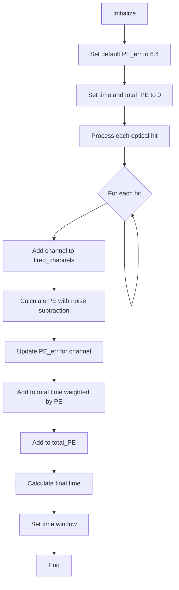
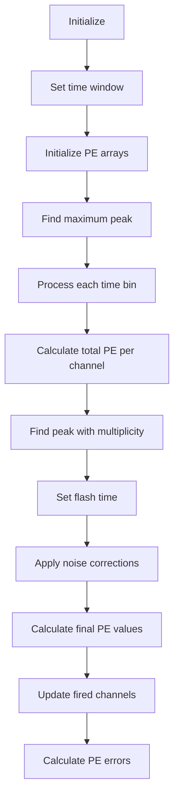
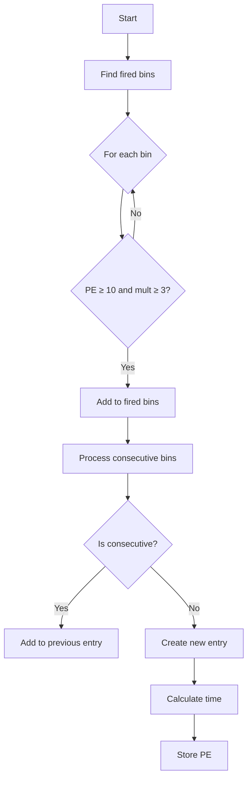
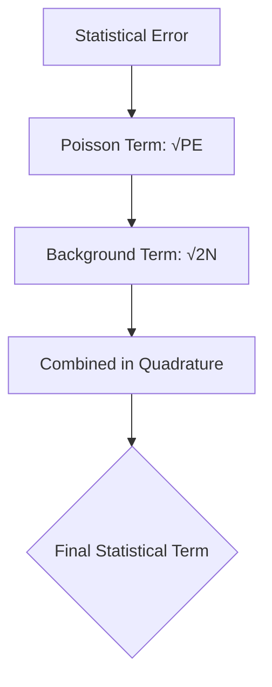

# Opflash Class Documentation

## Overview
The Opflash class appears to be designed to handle optical flash data in particle detection, likely from photomultiplier tubes (PMTs). It manages both the flash characteristics and PMT response data.

## Internal Variables

### Core Flash Properties
- `type`: int - Indicates the type of flash (1 for normal ophits, 2 for histogram-based)
- `flash_id`: int - Unique identifier for the flash
- `time`: double - The time of the flash event
- `low_time`: double - Lower bound of the flash time window
- `high_time`: double - Upper bound of the flash time window
- `total_PE`: double - Total photoelectrons detected across all PMTs

### PMT Data Arrays
- `PE[32]`: double array - Photoelectron counts for each of the 32 PMTs
- `PE_err[32]`: double array - Error estimates for PE counts
- `fired_channels`: vector<int> - List of PMT channels that detected signal

### L1 Trigger Information
- `l1_fired_time`: vector<double> - Time information for L1 triggers
- `l1_fired_pe`: vector<double> - PE information for L1 triggers

## Member Functions

### Constructors
1. `Opflash(COphitSelection &ophits)`
   - Constructs flash object from optical hit selection
   - Processes raw hits into flash data

2. `Opflash(TH1F **hist, double start_time, int start_bin, int end_bin, float bin_width)`
   - Constructs flash object from histogram data
   - Handles binned PMT data

3. `Opflash(int type, int flash_id, double low_time, double high_time, double time, double total_PE, std::vector<int>& fired_channels, double* temp_PE, double* temp_PE_err, std::vector<double>& l1_fired_time, std::vector<double>& l1_fired_pe)`
   - Full constructor with all parameters
   - Used for creating flash object with pre-computed values

### Getters
- `get_flash_id()`: Returns flash identifier
- `get_time()`: Returns flash time
- `get_total_PE()`: Returns total photoelectrons
- `get_PE(int ch)`: Returns PE count for specific channel
- `get_PE_err(int ch)`: Returns PE error for specific channel
- `get_fired(int ch)`: Returns whether specific channel was fired
- `get_num_fired()`: Returns number of fired channels
- `get_type()`: Returns flash type
- `get_low_time()`: Returns lower time bound
- `get_high_time()`: Returns upper time bound
- `get_l1_fired_time()`: Returns L1 trigger times
- `get_l1_fired_pe()`: Returns L1 trigger PE values

### Setters
- `set_flash_id(int value)`: Sets flash identifier
- `set_flash_type(int value)`: Sets flash type

### Utility Functions
- `swap_channels()`: Swaps channel ordering (specifically channels 26-31)
- `Add_l1info(TH1F *hist_tot_pe, TH1F *hist_mult, double start_time, int start_bin, int end_bin, float bin_width)`: Adds L1 trigger information

## Usage Notes

1. The class is designed to work with a 32-channel PMT system
2. Three different construction methods are provided for different data sources:
   - Direct optical hits
   - Histogram-based data
   - Pre-computed values
3. Channel swapping functionality suggests specific detector geometry considerations
4. L1 trigger information can be added after initial construction

## Error Handling
- PE errors are tracked per channel
- Base systematic uncertainties of 2% are applied
- Special handling for PE values in different ranges

## Detailed Function Analysis

### Constructor from Optical Hits
```cpp
WCP::Opflash::Opflash(COphitSelection &ophits)
```

This constructor processes raw optical hits to create a flash object. Here's the logical flow:



Key aspects:
- PE calculation includes noise subtraction: `PE = hit.get_PE() - 0.15*2`
- Time window is set as:
  - `low_time = time - 3 * 15.625/1000`
  - `high_time = time + 37 * 15.625/1000`

### Constructor from Histogram
```cpp
WCP::Opflash::Opflash(TH1F **hist, double start_time, int start_bin, int end_bin, float bin_width)
```

This constructor builds flash data from histogram bins. The process is more complex:



Notable features:
- Uses multiplicity criterion (≥3 channels) for peak finding
- Applies sophisticated noise correction:
```cpp
double pe_noise_scaled = 1.875*(end_bin-std::max(start_bin,0))/78.;
// Subtract scaled noise from each channel
PE[i] -= pe_noise_scaled;
```

### Add_l1info Function
```cpp
void WCP::Opflash::Add_l1info(TH1F *hist_tot_pe, TH1F *hist_mult, double start_time, 
                             int start_bin, int end_bin, float bin_width)
```

This function processes L1 trigger information:



Key thresholds:
- Minimum PE: 10
- Minimum multiplicity: 3
- Consecutive bins are merged into single triggers

### Channel Swapping Function
```cpp
void WCP::Opflash::swap_channels()
```

Special function for rearranging PMT channels 26-31 in a circular pattern:
```cpp
26 -> 27 -> 28 -> 29 -> 30 -> 31 -> 26
```

Implementation includes swapping both PE values and error estimates:
```cpp
double temp = PE[31];
PE[31] = PE[30];
PE[30] = PE[29];
// ... continues for all channels
```

This suggests a specific detector geometry where physical channel locations need remapping.

# Error Calculation Methodology

## Overview of Error Sources
The Opflash class implements a comprehensive error calculation system that accounts for multiple sources of uncertainty in PMT measurements:

1. Base Systematic Uncertainties
2. Statistical Fluctuations
3. Signal-Dependent Systematic Effects
4. Background Noise Contributions
5. Special Case Handling

## Base Error Components

### 1. Default Error Floor
```cpp
PE_err[i] = 6.4;  // Set in ophits constructor
PE_err[i] = 0.2;  // Set in histogram constructor
```
These represent the minimum uncertainty in PE measurements, even with no signal. The difference (6.4 vs 0.2) reflects different calibration methods between direct hits and histogram-based reconstruction.

### 2. Statistical Error
The statistical component follows Poisson statistics with additional terms:



Where:
```cpp
statistical_term = sqrt(PE[i] + pe_noise_scaled * 2)
```

The `pe_noise_scaled` term is calculated as:
```cpp
pe_noise_scaled = 1.875 * (end_bin - std::max(start_bin,0)) / 78.;
```
This scaling accounts for the time window dependence of the background.

### 3. Systematic Uncertainties

#### Base Systematic
A flat 2% systematic uncertainty is applied to all measurements:
```cpp
systematic_base = PE[i] * 0.02  // 2% of measured PE
```

#### Enhanced Systematics for Special Cases
The class implements additional systematic uncertainties for specific scenarios:

1. **High PE Values (commented code shows historical approach)**:
```cpp
// Historical implementation (currently commented out):
if (PE[i] < 1000) {
    systematic = PE[i] * 0.02;  // 2% for normal signals
} else if (PE[i] < 2000) {
    systematic = PE[i] * 0.06;  // 6% for high signals
} else {
    systematic = PE[i] * 0.18;  // 18% for very high signals
}
```

2. **PMT Proximity Effects**:
When a flash is detected close to PMTs (flag_close_to_PMT is true), additional uncertainty is added:
```cpp
if (flag_close_to_PMT && pe[j]-pred_pe[j]>350 && pe[j]>pred_pe[j]*1.3) {
    error_term = sqrt(pow(pe_err[j],2) + pow(pe[j]*0.5,2));
}
```

## Error Combination Methodology

The final error is calculated by combining all components in quadrature:

```cpp
PE_err[i] = sqrt(
    pow(base_error, 2) +           // Base systematic floor
    (PE[i] + pe_noise_scaled*2) +  // Statistical term
    pow(PE[i]*0.02, 2)            // Proportional systematic
);
```

## Special Cases and Corrections

### 1. Poor Baseline Conditions
When baseline conditions are poor (good_baseline = false):
```cpp
if (!good_baseline) {
    PE_err = 2 * PE;  // 200% uncertainty
}
```

### 2. Small Signal Handling
For very small signals (historically):
```cpp
if (PE < 12) {  // too small
    PE_err = sqrt(pow(PE_err,2) + pow(4.6,2));
    good_baseline = false;
}
```

### 3. Channel-Specific Corrections
Channel 28 receives special treatment:
```cpp
if (channel_no == 28) integral = cal_integral(peak);
```

## Error Propagation in Analysis

The error calculations affect various analysis steps:

1. **Flash Matching:**
```cpp
double cur_chi2 = pow(pred_pe[j]-pe[j],2)/pow(pe_err[j],2);
```
Chi-square calculations use these errors for flash-matching quality assessment.

2. **Bundle Analysis:**
The errors are used in bundle comparison and quality metrics:
```cpp
if (pe[max_bin] == 0 && pred_pe[max_bin]>0) {
    chi2 -= max_chi2-1;  // Allow one PMT to be inefficient
}
```

## Calibration Considerations

The error calculation system includes several calibration-dependent constants:
1. Base error floors (6.4 or 0.2 PE)
2. Noise scaling factor (1.875)
3. Systematic uncertainty percentages (2%, 6%, 18%)
4. Time window corrections (78. denominator in noise scaling)

These values should be validated and potentially updated with new calibration data.

### Channel Firing Detection
```cpp
bool WCP::Opflash::get_fired(int ch)
```

Simple lookup in fired_channels vector using std::find:
```cpp
return std::find(fired_channels.begin(), 
                fired_channels.end(), 
                ch) != fired_channels.end();
```