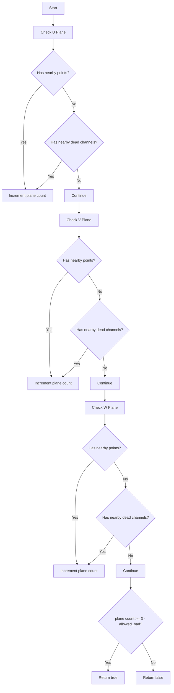
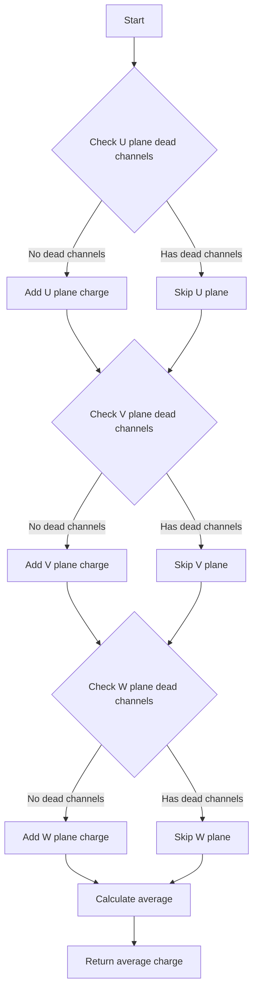
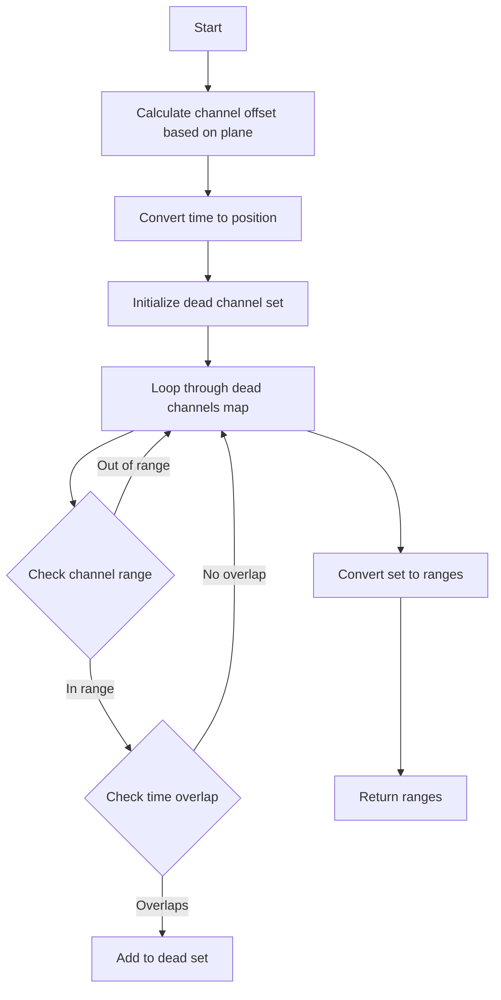
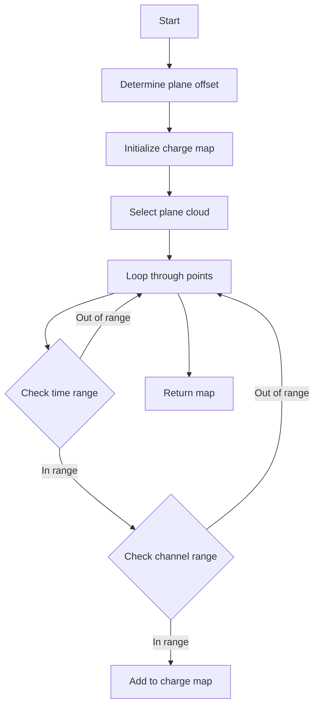
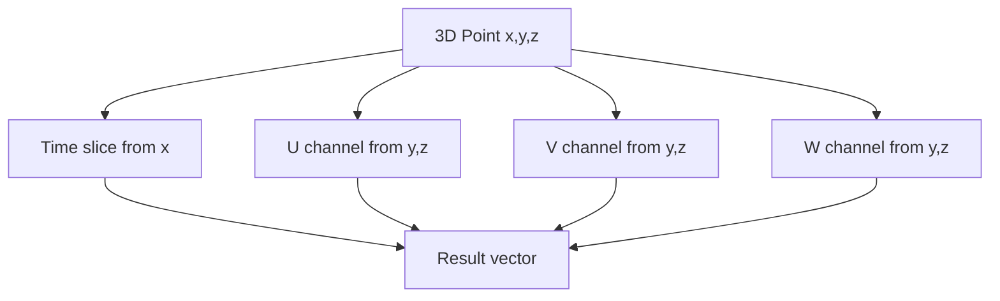
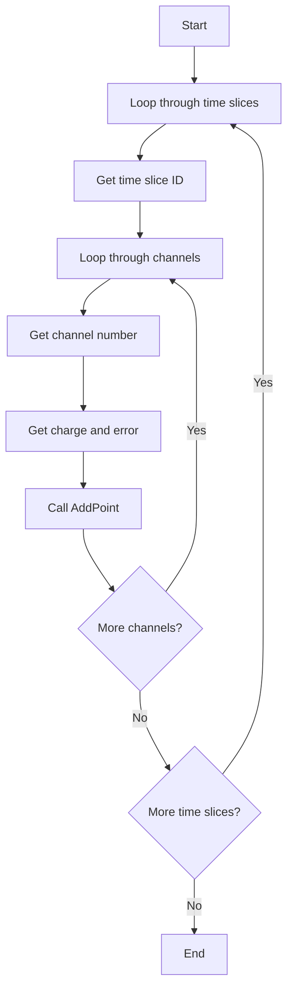
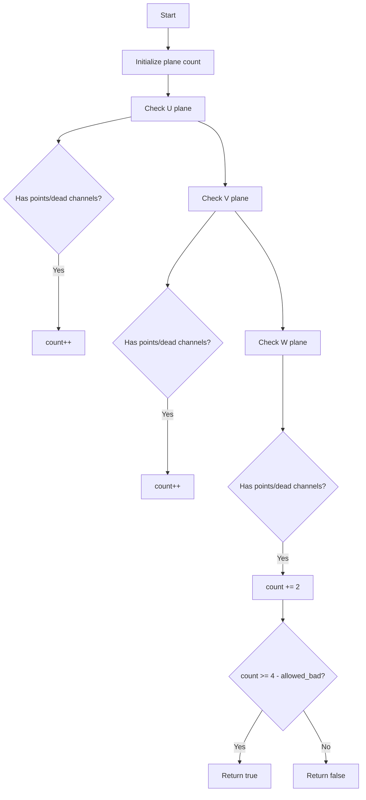
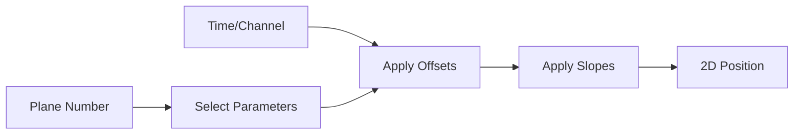

# ToyCTPointCloud Class Documentation

## Overview
The ToyCTPointCloud class manages point cloud data for three wire planes (U, V, W) in a particle detector. It handles charge deposition data, dead channels, and provides utilities for spatial analysis.

## Class Members

### Internal Variables

#### Channel Configuration
- `u_min_ch`, `u_max_ch`: Channel range for U plane
- `v_min_ch`, `v_max_ch`: Channel range for V plane  
- `w_min_ch`, `w_max_ch`: Channel range for W plane
- `dead_uchs`, `dead_vchs`, `dead_wchs`: Maps storing dead channels (channel -> [min_pos, max_pos]) for each plane

#### Wire Angles
- `angle_u`, `angle_v`, `angle_w`: Wire angles for each plane in radians

#### Coordinate Conversion Parameters
- `offset_t`, `slope_t`: Parameters for converting time slice to position
  - Position = (time_slice - offset_t) / slope_t
- `offset_u`, `slope_u`: Parameters for converting U wire number to position
- `offset_v`, `slope_v`: Parameters for converting V wire number to position
- `offset_w`, `slope_w`: Parameters for converting W wire number to position

#### Data Storage
- `cloud_u`, `cloud_v`, `cloud_w`: CTPointCloud objects storing points for each plane
- `index_u`, `index_v`, `index_w`: KD-tree indices for efficient spatial searching

## Detailed Function Analysis

### Complex Function Deep Dives

#### Point Validation: `is_good_point`
```cpp
bool is_good_point(WCP::Point& p, double radius, int ch_range, int allowed_bad)
```
This function determines if a 3D point has adequate detector coverage across the three wire planes.

**Logic Flow:**


**Key Points:**
- Checks each plane (U, V, W) for either:
  - Active points within the specified radius
  - Dead channels within the channel range
- Increments a counter for each plane with coverage
- Returns true if enough planes (3 - allowed_bad) have coverage

#### Dead Channel Detection: `get_closest_dead_chs`
```cpp
bool get_closest_dead_chs(WCP::Point& p, int plane, int ch_range)
```
This function checks if a point is near any dead channels in a specified plane.

**Implementation Details:**
1. Converts 3D point to time-channel coordinates for all planes
2. Adjusts channel numbers based on plane offsets
3. For the specified plane:
   - Checks channels within ±ch_range of the point's channel
   - For each channel, verifies if it's in dead channel map
   - Checks if point's time coordinate falls within dead channel's time range

```cpp
std::vector<int> results = convert_3Dpoint_time_ch(p);
// Adjust channel numbers for V and W planes
results.at(2) -= u_max_ch - u_min_ch + 1;
results.at(3) -= v_max_ch - v_min_ch + 1 + u_max_ch - u_min_ch + 1;

// Example for U plane (plane == 0)
for (int ch = results.at(1) - ch_range; ch <= results.at(1) + ch_range; ch++) {
    if (dead_uchs.find(ch) == dead_uchs.end()) continue;
    if (p.x >= dead_uchs[ch].first && p.x <= dead_uchs[ch].second)
        return true;
}
```

#### Point Cloud Search: `get_closest_points`
This function retrieves points near a specified 3D point in a given plane.

**Logic Flow:**
1. Projects 3D point onto 2D plane based on wire angles
2. Uses KD-tree to find points within search radius
3. Collects corresponding points from point cloud

```cpp
std::vector<std::pair<size_t,double>> get_closest_index(WCP::Point& p, 
                                                       double search_radius, 
                                                       int plane) {
    double x, y;
    // Project point to 2D based on plane's wire angle
    if (plane == 0) {
        x = p.x;
        y = cos(angle_u) * p.z - sin(angle_u) * p.y;
    }
    // Similar for other planes...

    double query_pt[2] = {x, y};
    std::vector<std::pair<size_t,double>> ret_matches;
    nanoflann::SearchParams params;
    
    // Use appropriate KD-tree based on plane
    if (plane == 0) {
        index_u->radiusSearch(&query_pt[0], search_radius*search_radius, 
                            ret_matches, params);
    }
    // Similar for other planes...
    return ret_matches;
}
```

#### Average Charge Calculation: `get_ave_3d_charge`
This function calculates the average charge around a point across all planes.

**Logic Flow:**


**Implementation Details:**
- Skips planes with dead channels
- For each valid plane:
  - Gets nearby points using KD-tree
  - Calculates average charge from those points
- Returns overall average across all valid planes

#### Overlap Dead Channel Detection: `get_overlap_dead_chs`
```cpp
std::vector<std::pair<int, int>> get_overlap_dead_chs(int min_time, int max_time, 
    int min_ch, int max_ch, int plane_no, bool flag_ignore_time)
```

This function finds ranges of dead channels that overlap with a specified time-channel window.

**Logic Flow:**


**Implementation Details:**
1. Channel Offset Calculation:
```cpp
int ch_offset = 0;
if (plane_no == 1) {
    ch_offset = u_max_ch - u_min_ch + 1;
} else if (plane_no == 2) {
    ch_offset = v_max_ch - v_min_ch + 1 + u_max_ch - u_min_ch + 1;
}
```

2. Time to Position Conversion:
```cpp
double min_xpos = (min_time-offset_t)/slope_t;
double max_xpos = (max_time-offset_t)/slope_t;
```

3. Dead Channel Range Construction:
```cpp
std::vector<std::pair<int, int>> dead_ch_range;
for (auto it = dead_chs.begin(); it != dead_chs.end(); it++) {
    if (dead_ch_range.size() == 0) {
        dead_ch_range.push_back(std::make_pair(*it, *it));
    } else {
        if (*it - dead_ch_range.back().second == 1) {
            dead_ch_range.back().second = *it;
        } else {
            dead_ch_range.push_back(std::make_pair(*it, *it));
        }
    }
}
```

#### Good Channel Charge Mapping: `get_overlap_good_ch_charge`
```cpp
std::map<std::pair<int,int>, std::pair<double,double>> get_overlap_good_ch_charge(
    int min_time, int max_time, int min_ch, int max_ch, int plane_no)
```

This function creates a map of charges for good (non-dead) channels in a specified region.

**Logic Flow:**


**Key Points:**
- Maps (time,channel) pairs to (charge,charge_error) pairs
- Handles different channel numbering schemes for each plane
- Filters points based on time and channel ranges

#### Update Dead Channels: `UpdateDeadChs`
This function updates dead channel information based on the current point cloud data.

**Logic Flow:**
1. Creates live channel maps for each plane
2. For each point in clouds:
   - Records channel's live regions
   - Updates position ranges for active channels

```cpp
// Example for U plane points
for (size_t i = 0; i != cloud_u.pts.size(); i++) {
    int ch = std::round(cloud_u.pts.at(i).channel);
    double xpos = (cloud_u.pts.at(i).time_slice - offset_t)/slope_t;
    
    if (live_uchs.find(ch) == live_uchs.end()) {
        live_uchs[ch] = std::make_pair(xpos - 0.1*units::cm, 
                                     xpos + 0.1*units::cm);
    } else {
        // Update ranges
        if (xpos + 0.1*units::cm > live_uchs[ch].second) 
            live_uchs[ch].second = xpos + 0.1*units::cm;
        if (xpos - 0.1*units::cm < live_uchs[ch].first) 
            live_uchs[ch].first = xpos - 0.1*units::cm;
    }
}
```

#### 3D Point to Channel Conversion: `convert_3Dpoint_time_ch`
```cpp
std::vector<int> convert_3Dpoint_time_ch(WCP::Point& p)
```

This function converts a 3D point to time and channel coordinates for all planes.

**Implementation Details:**
1. Time slice calculation:
```cpp
int time_slice = std::round(p.x * slope_t + offset_t);
```

2. Channel calculations for each plane:
```cpp
// U plane
double y = cos(angle_u) * p.z - sin(angle_u) * p.y;
int ch_u = std::round(y * slope_u + offset_u + u_min_ch);

// V plane (similar calculation with angle_v)
y = cos(angle_v) * p.z - sin(angle_v) * p.y;
int ch_v = std::round(y * slope_v + offset_v + v_min_ch);

// W plane (similar calculation with angle_w)
y = cos(angle_w) * p.z - sin(angle_w) * p.y;
int ch_w = std::round(y * slope_w + offset_w + w_min_ch);
```

3. Channel boundary enforcement:
```cpp
// Example for U plane
if (ch_u < u_min_ch) {
    ch_u = u_min_ch;
} else if (ch_u > u_max_ch) {
    ch_u = u_max_ch;
}
```

**Coordinate System:**


#### Point Addition And KD-Tree: `AddPoints` and `build_kdtree_index`

The point addition and indexing system is a core part of the ToyCTPointCloud class, involving multiple interconnected functions.

**AddPoints Logic Flow:**


**Implementation Details:**
```cpp
void AddPoints(std::vector<int> *timesliceId,
              std::vector<std::vector<int>> *timesliceChannel,
              std::vector<std::vector<int>> *raw_charge,
              std::vector<std::vector<int>> *raw_charge_err) {
    for (size_t i = 0; i != timesliceId->size(); i++) {
        int time_slice = timesliceId->at(i);
        for (size_t j = 0; j != timesliceChannel->at(i).size(); j++) {
            int ch = timesliceChannel->at(i).at(j);
            int charge = raw_charge->at(i).at(j);
            int charge_err = raw_charge_err->at(i).at(j);
            AddPoint(ch, time_slice, charge, charge_err);
        }
    }
}
```

**AddPoint Function:**
```cpp
void AddPoint(int ch, int time_slice, int charge, int charge_err) {
    int plane = 0;
    if (ch >= v_min_ch && ch <= v_max_ch) {
        plane = 1;
    } else if (ch >= w_min_ch && ch <= w_max_ch) {
        plane = 2;
    }
    
    CTPointCloud<double>::CTPoint point;
    point.channel = ch;
    point.time_slice = time_slice;
    point.charge = charge;
    point.charge_err = charge_err;
    point.x = (time_slice-offset_t)/slope_t;
    
    // Add to appropriate plane's cloud
    if (plane == 0) {
        point.y = (ch-offset_u-u_min_ch)/slope_u;
        point.index = cloud_u.pts.size();
        cloud_u.pts.push_back(point);
    } else if (plane == 1) {
        point.y = (ch-offset_v-v_min_ch)/slope_v;
        point.index = cloud_v.pts.size();
        cloud_v.pts.push_back(point);
    } else if (plane == 2) {
        point.y = (ch-offset_w-w_min_ch)/slope_w;
        point.index = cloud_w.pts.size();
        cloud_w.pts.push_back(point);
    }
}
```

**KD-Tree Building:**
```cpp
void build_kdtree_index() {
    // Clean up existing indices
    if (index_u != 0) delete index_u;
    if (index_v != 0) delete index_v;
    if (index_w != 0) delete index_w;

    // Build new indices
    index_u = new my_kd_tree_ct_t(2, cloud_u, 
        nanoflann::KDTreeSingleIndexAdaptorParams(10));
    index_u->buildIndex();

    index_v = new my_kd_tree_ct_t(2, cloud_v, 
        nanoflann::KDTreeSingleIndexAdaptorParams(10));
    index_v->buildIndex();

    index_w = new my_kd_tree_ct_t(2, cloud_w, 
        nanoflann::KDTreeSingleIndexAdaptorParams(10));
    index_w->buildIndex();
}
```

#### Advanced Point Analysis: `is_good_point_wc`
This is a variant of `is_good_point` that gives double weight to the W plane.

**Logic Flow:**


**Key Differences from is_good_point:**
- W plane matches contribute 2 points instead of 1
- Total required score is 4 instead of 3
- Useful for algorithms that rely more heavily on W plane data

#### Coordinate Transformation: `convert_time_ch_2Dpoint`
```cpp
std::pair<double,double> convert_time_ch_2Dpoint(int timeslice, 
                                                int channel, 
                                                int plane)
```

This function converts time-channel coordinates back to 2D space positions.

**Implementation Details:**
```cpp
// Convert time to x position
double x = (timeslice - offset_t)/slope_t;

// Convert channel to y position based on plane
double y;
if (plane == 0) {
    y = (channel - u_min_ch - offset_u)/slope_u;
} else if (plane == 1) {
    y = (channel - v_min_ch - offset_v)/slope_v;
} else if (plane == 2) {
    y = (channel - w_min_ch - offset_w)/slope_w;
}
return std::make_pair(x,y);
```

**Coordinate Transformation Flow:**


#### Debug Utility: `Print`
```cpp
void Print(WCP::Point &p)
```

This debugging function prints various coordinate transformations of a point.

**Output Information:**
1. 3D coordinates in cm
2. Time coordinate
3. U plane projection
4. V plane projection
5. W plane projection

```cpp
void Print(WCP::Point &p) {
    // Print 3D coordinates in cm
    std::cout << p.x/units::cm << " " << p.y/units::cm << " " 
              << p.z/units::cm << std::endl;
    
    // Print time coordinate
    std::cout << p.x*slope_t+offset_t << std::endl;
    
    // Print U projection
    std::cout << (cos(angle_u) * p.z - sin(angle_u) *p.y)*slope_u+offset_u 
              << std::endl;
    
    // Print V projection
    std::cout << (cos(angle_v) * p.z - sin(angle_v) *p.y)*slope_v+offset_v 
              << std::endl;
    
    // Print W projection
    std::cout << (cos(angle_w) * p.z - sin(angle_w) *p.y)*slope_w+offset_w 
              << std::endl;
}
```

### Member Functions

#### Construction/Destruction
```cpp
// Constructor - initializes all plane parameters
ToyCTPointCloud(int u_min_ch, int u_max_ch, int v_min_ch, int v_max_ch, 
                int w_min_ch, int w_max_ch, double offset_t, double offset_u, 
                double offset_v, double offset_w, double slope_t, double slope_u, 
                double slope_v, double slope_w, double angle_u = 1.0472, 
                double angle_v = -1.0472, double angle_w = 0)

// Destructor - cleans up KD-trees and point clouds
~ToyCTPointCloud()
```

#### Point Management
```cpp
// Add a single point to appropriate plane's point cloud
void AddPoint(int ch, int time_slice, int charge, int charge_err)

// Add multiple points from time slice data
void AddPoints(std::vector<int> *timesliceId, 
              std::vector<std::vector<int>> *timesliceChannel,
              std::vector<std::vector<int>> *raw_charge,
              std::vector<std::vector<int>> *raw_charge_err)

// Build KD-tree indices for all planes
void build_kdtree_index()
```

#### Dead Channel Management
```cpp
// Add dead channel information for all planes
void AddDeadChs(std::map<int,std::pair<double,double>>& dead_u_index,
                std::map<int,std::pair<double,double>>& dead_v_index,
                std::map<int,std::pair<double,double>>& dead_w_index)

// Update dead channel information based on point cloud data
void UpdateDeadChs()

// Get all dead channels across all planes
std::map<int, std::pair<int, int>> get_all_dead_chs()

// Get overlapping dead channels in a specific region
std::vector<std::pair<int,int>> get_overlap_dead_chs(int min_time, int max_time,
                                                    int min_ch, int max_ch,
                                                    int plane_no,
                                                    bool flag_ignore_time=false)

// Check if a point is near dead channels
bool get_closest_dead_chs(WCP::Point& p, int plane, int ch_range=1)
```

#### Point Analysis
```cpp
// Check if a point has good coverage across planes
bool is_good_point(WCP::Point& p, double radius = 0.6*units::cm,
                  int ch_range = 1, int allowed_bad = 1)

// Similar to is_good_point but with different weighting for W plane
bool is_good_point_wc(WCP::Point& p, double radius = 0.6*units::cm,
                     int ch_range = 1, int allowed_bad = 1)

// Test point quality and return detailed plane information
std::vector<int> test_good_point(WCP::Point& p, double radius = 0.6*units::cm,
                                int ch_range = 1)
```

#### Charge Analysis
```cpp
// Get average charge around a point in a specific plane
double get_ave_charge(WCP::Point& p, double radius = 0.3*units::cm, int plane = 0)

// Get average charge around a point across all planes
double get_ave_3d_charge(WCP::Point& p, double radius = 0.3*units::cm)

// Get charge information for good channels in a region
std::map<std::pair<int,int>, std::pair<double,double>> get_overlap_good_ch_charge(
    int min_time, int max_time, int min_ch, int max_ch, int plane_no)
```

#### Point Cloud Access
```cpp
// Get number of points in a plane
int get_num_points(int plane)

// Get reference to point cloud for a plane
CTPointCloud<double>& get_cloud(int plane)

// Get points near a specified point
CTPointCloud<double> get_closest_points(WCP::Point& p, double radius, int plane)
```

#### Coordinate Conversion
```cpp
// Convert 3D point to time and channel coordinates
std::vector<int> convert_3Dpoint_time_ch(WCP::Point& p)

// Convert time and channel to 2D point coordinates
std::pair<double,double> convert_time_ch_2Dpoint(int timeslice, int channel,
                                                int plane)
```

#### Utility Functions
```cpp
// Print point information for debugging
void Print(WCP::Point &p)

// Get indices of points within search radius
std::vector<std::pair<size_t,double>> get_closest_index(WCP::Point& p,
                                                       double radius, int plane)

// Get channel limits for each plane
std::pair<int,int> get_uch_limits()
std::pair<int,int> get_vch_limits()
std::pair<int,int> get_wch_limits()
```